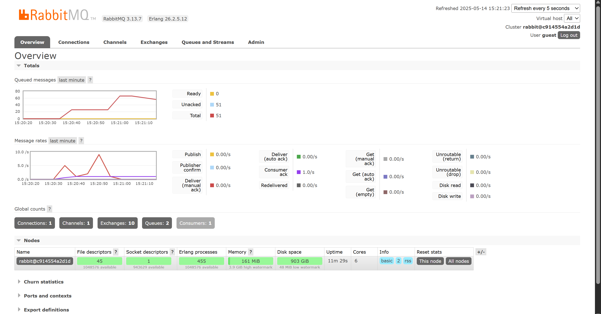
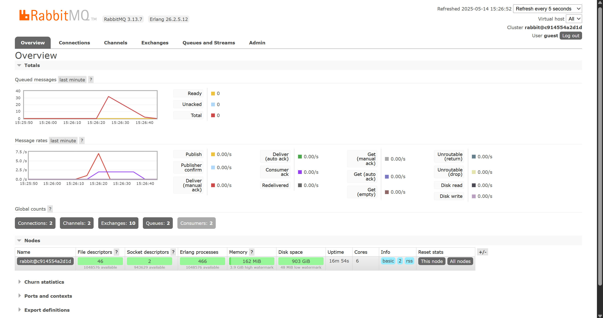

Name    : Andrew Devito Aryo

NPM     : 2306152494

Class   : ADVPRO - A

# Module 10 - Subscriber - Reflection
### a. What is *amqp*?
AMQP (Advanced Message Queuing Protocol) is an open standard application layer protocol for message-oriented middleware. It enables the communication between different applications or services by sending messages through a broker, allowing for reliable and efficient message delivery.

### b. What does it mean? `guest:guest@localhost:5672` , what is the first guest, and what is the second guest, and what is localhost:5672 is for?
The first "guest" is the username, and the second "guest" is the password for authentication. "localhost:5672" refers to the address and port of the RabbitMQ server, where "localhost" indicates that the server is running on the same machine, and "5672" is the default port for AMQP connections.

### Monitoring Chart (After Uncomment Thread Sleep - Simulation of Slow Subscribers)

Based on the image, the peak of the queue is around 70, and the total processing time peak around 10/s. This caused by pile up of messages in the queue because the subscriber is slow to process the messages. The queue is not being consumed fast enough, leading to a backlog of messages waiting to be processed.

### Monitoring Chart (After Open 3 Terminals of Subscriber)

The monitoring indicates that having 3 subscribers is better than having just 1 because it allows for parallel processing of messages. This means that multiple messages can be consumed and processed simultaneously, leading to improved performance and reduced latency. 